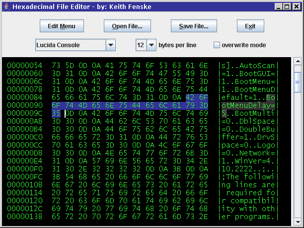

### Hex File Editor (Java)

by: Keith Fenske, https://kwfenske.github.io/

HexEdit is a Java 1.4 graphical (GUI) application to edit a file as a stream of
hexadecimal digits, where each 8-bit byte is represented by two 4-bit "nibbles"
(the hex digits). No meaning is attached to the digits, and hence to the
contents of the file, so this editing is very raw. You can insert, delete, or
replace digits or bytes, and you may view an approximate character equivalent
of the digits in plain text (7-bit ASCII). The primary purpose of a hex editor
is to patch or correct specific locations within a file without affecting the
rest of the file, something that most word processors can't do. A secondary
purpose is to view the exact content of files.

Download the ZIP file here: https://kwfenske.github.io/hex-file-editor-java.zip

Released under the terms and conditions of the Apache License (version 2.0 or
later) and/or the GNU General Public License (GPL, version 2 or later).

Please see the HexView application, which is better for most users:
https://github.com/kwfenske/hex-file-viewer-java
